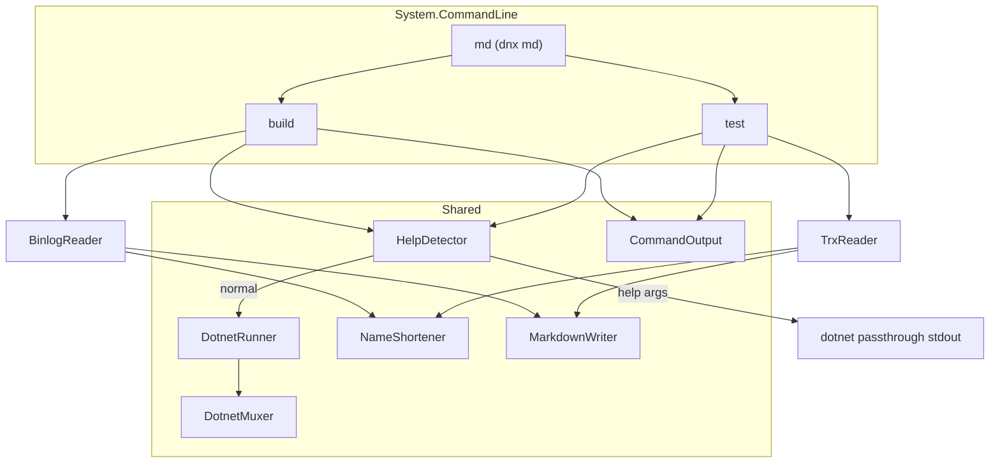

# md: minimal markdown dotnet build/test tool

> Approved plan (revised). Source: Grok plan session `019eac90-4593-7f03-a552-3a587bdf78cb`.

## Goal

Implement `md` as a **net10** global dotnet tool invoked via `dnx md -y build|test`, using **binlog `GetTargetPath` items** and **TRX** structured APIs, **System.CommandLine**, help passthrough to dotnet, and token-minimal markdown with shared-prefix reference shortening.

## Invocation

```shell
dnx md -y build [dotnet build args...]
dnx md -y test  [dotnet test args...]
```

## Output contract

Plain markdown to stdout. No ANSI. Stderr only for tool-internal failures.

**Formatting rule:** always emit a **blank line before reference-definition footers** (`[n]: ...`).

### `build` success

```text
✅[1]Api.dll
✅[1]Web.dll
✅[1]Tests.dll

[1]: Microsoft.Data.Ingestion.
```

Single assembly with no shared prefix: `✅MyProject.dll` (no footer).

### `test` success

Per-assembly counts from TRX only:

```text
[1]Tests.dll ✅23 ⏩5
[1]IntegrationTests.dll ✅10

[1]: MyCompany.MyApp.
```

Omit zero-count icons (`❌0` not shown).

### `build` failure

```text
❌[1]Tests.csproj
> path/to/File.cs:42 CS1002: message

[1]: MyCompany.MyApp.
```

No `# build failed` header. Errors from structured binlog `Error` nodes: relative paths, no timestamps.

### `test` failure

```text
[1]Tests.dll ✅20 ❌2
❌[2]CalculatorTests.Adds
> ```csharp
> Assert.Equal() Failure...
> ```

[1]: MyCompany.MyApp.
[2]: MyCompany.MyApp.Tests.
```

- No `## failures` header
- `NameShortener` on test FQN namespaces (same ref pattern as assemblies)
- Stack trimmed at test method frame (adapt dotnet-retest `TrxCommand.WriteError`)

## Architecture



## Key design decisions

| Topic | Decision |
|-------|----------|
| CLI framework | **System.CommandLine** |
| App name in help | Display as `dnx md` |
| Arg forwarding | Forward **all** remaining args; no `--` separator |
| Options we own | **`--version` only** at root; `-?`/`-h`/`--help` passthrough to dotnet |
| Help behavior | Run `dotnet build\|test` with help args **without output capture** (streaming) |
| Target framework | **`net10.0` only** |
| Build data source | Inject `-bl:<temp.binlog>` if absent; **MSBuild.StructuredLogger** — no text parsing |
| Build success path | Per `Project`: succeeded `GetTargetPath` → returned `TargetOutputs` items |
| Test data source | Inject `--logger trx` + `--results-directory <temp>` if missing; **TRX only** |
| CI workflow | **No changes** to `.github/workflows/build.yml` |
| Agent docs | `AGENTS.md` at repo root; `.github/copilot-instructions.md` → pointer only |
| help.md / RenderHelp | **Removed** |

## Files to create (plan)

| Path | Role |
|------|------|
| `src/md/Program.cs` | System.CommandLine root + subcommands |
| `src/md/BuildCommand.cs` | build handler |
| `src/md/TestCommand.cs` | test handler |
| `src/md/HelpDetector.cs` | help → passthrough |
| `src/md/DotnetMuxer.cs` | resolve dotnet path |
| `src/md/DotnetRunner.cs` | CliWrap execution |
| `src/md/DotnetBuildArguments.cs` | `-bl` injection / path resolution |
| `src/md/DotnetTestArguments.cs` | trx / results-directory injection |
| `src/md/CommandOutput.cs` | replay stdout / fallback when no markdown |
| `src/md/Formatting/NameShortener.cs` | prefix shortening |
| `src/md/Formatting/MarkdownWriter.cs` | body + blank line + ref footer |
| `src/md/Parsing/BinlogReader.cs` | GetTargetPath items + Error nodes |
| `src/md/Parsing/TrxReader.cs` | TRX aggregation + failures |
| `AGENTS.md` | repo-level agent instructions |
| `src/Tests/*` | unit tests + fixtures |

## Explicit non-goals

Retries, GitHub PR comments, progress UI, console text parsing, `--` separator, static `help.md`, `net8.0`, CI workflow dogfooding.

## Risks

| Risk | Mitigation |
|------|------------|
| `GetTargetPath` skipped for non-SDK projects | Only emit projects where target ran and returned items |
| User passes own `-bl:` | Detect and use their path |
| User passes non-trx `--logger` | Clear error if logger specified and not trx |
| Binlog locked after build | Read after process exit; delete in `finally` |